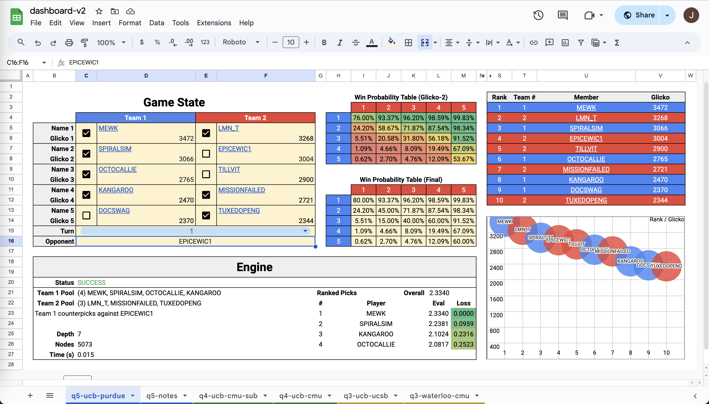

# Berkeley CTL Engine

During the 2024 Collegiate Tetris League (CTL), the [Tetris at Berkeley](https://callink.berkeley.edu/organization/tetris) team developed a series of dashboards (a collection of tools on Google Sheets spreadsheets) to help inform drafting picks under the [CTL counterpick format](https://www.youtube.com/watch?v=gv5Cqe1TWd4).

We've decided to make this open-source in hopes that all teams will be able to develop stronger, more interesting strategies with a collective effort, and that this collaborative work will be more fun than keeping everything secret.

## Dashboard
Our most recent dashboard (dashboard-v2) is [public on Google Sheets](https://docs.google.com/spreadsheets/d/1zOP3lPFG4dehiOtsPbCG8KcYQ0uP71Dau-bYvrgI-3s/edit?usp=sharing); you're encouraged to make a copy and play around with it.

Due to the limitations of Google Sheets, the engine part is a bit finnicky. Here's what it might look like when loaded properly:

## Documentation
See the [documentation](doc/doc.pdf) for a techincal description of the engine and a tutorial on how to use it.

## Engine Source Code
The source code used for Google Apps Script can be found at [Code.js](Code.js) (called Code.gs by Apps Script).